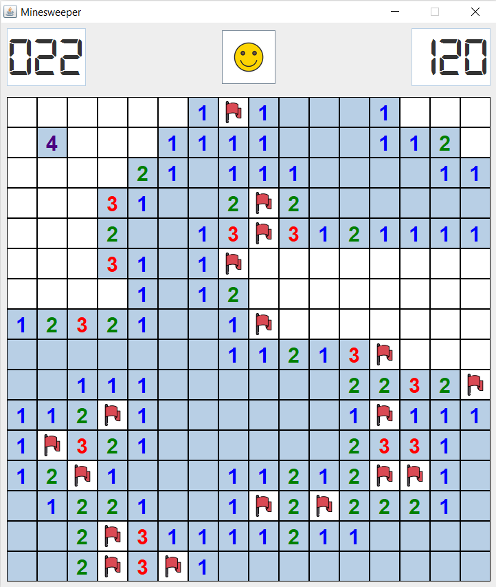
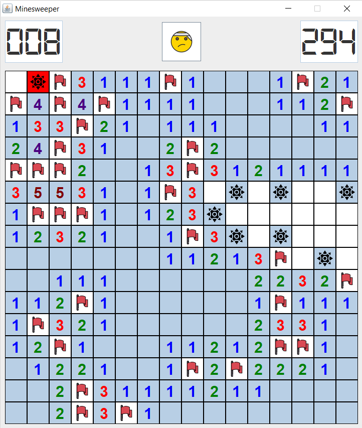
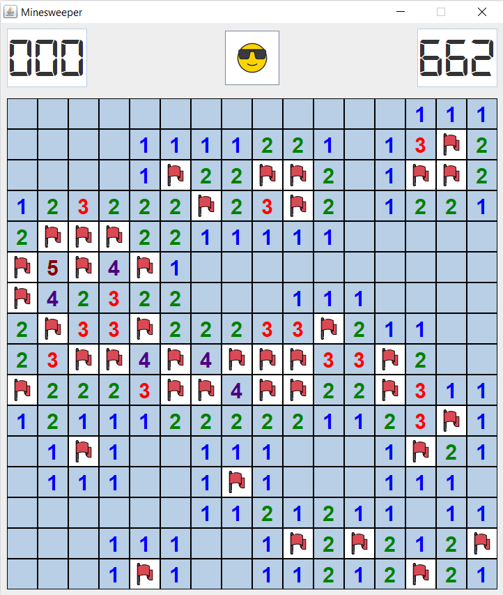
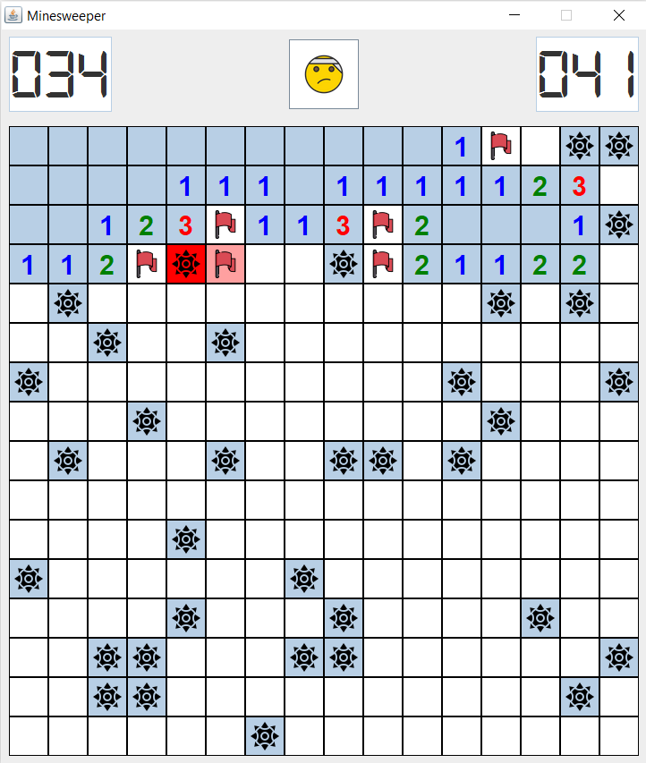

# Minesweeper Game

Minesweeper game made using `jython 2.7`. GUI is designed with `javax.swing`.

(Jython is an implementation of the Python programming language designed to run on the Java platform. It provides benefits of running Python on the JVM and access to classes written in Java.)

## Run

- Download and install jython 2.7
- Run the main.py file using Jython interpreter

```code
path/to/jython.exe main.py
```

## Screenshots








